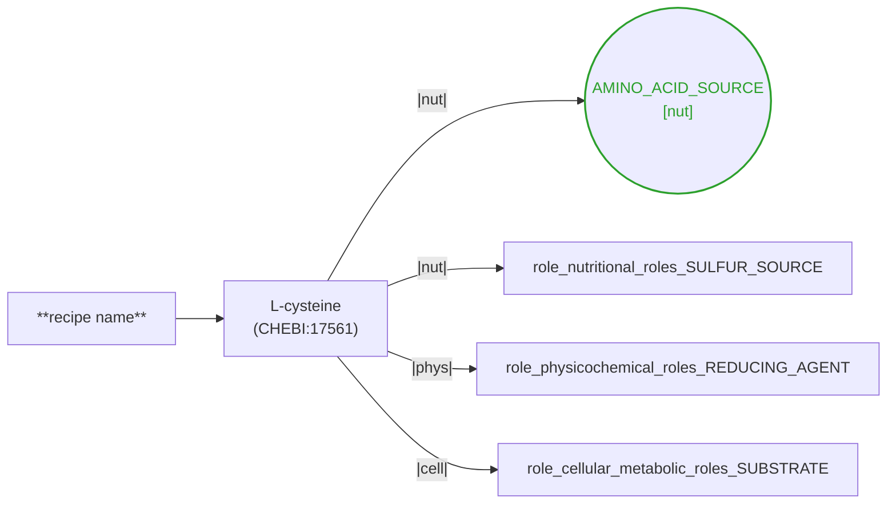

# render-media-role-graph

## Overview

Emits a **mermaid flowchart** of a MediaRecipe showing the medium ↔ ingredient ↔ role structure that the three-facet migration (PRs #93/#94/#95) laid down. Three modes:

- **single** — one recipe → one `.mmd` (the default when `--target` is a file path).
- **batch** — many recipes → one `.mmd` per recipe.
- **rollup** — cross-corpus aggregation of `(ingredient, facet, role-value)` frequencies → one summary `.mmd`.

Output goes to `reports/media_role_graphs/*.mmd`; consumers render in-browser (mermaid.js supports the .mmd source directly) or via `mmdc` for static PNG/SVG.

**Not** a Jinja template; standalone `.mmd` files. They can be embedded verbatim in markdown via a ```` ```mermaid ```` fence or referenced from `render_media_pages.py` (which already uses mermaid for the composition graph — this skill is a strict superset for the role axis).

## When to Use

| Scenario | Mode |
| -------- | ---- |
| "Show me what roles this specific recipe carries" | `single` |
| Post-backfill sanity check: did PR #95 (or Step 7b) assign facets I expect? | `single` on a curator's spot-check recipe |
| Review a batch of recipes for consistency of role assignments | `batch --limit N` |
| "Which ingredients across the corpus most commonly co-occur with which facet role?" | `rollup` |
| Building a docs page or PR body illustrating the role-facet model | `single --stdout` and paste under a ` ```mermaid ` fence |

**Not for**: computing role assignments (that's #95 mechanistic + #7b literature). This is read-only visualization.

## Inputs

- **`--target <path>`** — a MediaRecipe YAML. Any file under `data/normalized_yaml/**/*.yaml` (or `data/merge_yaml/**/*.yaml`).
- **`--yaml-dir <path>`** — for batch or rollup. Default target is `data/normalized_yaml/`.
- **`--mode {single|batch|rollup}`** — explicit mode. Auto-detected from which of the above two is passed.

Optional:

- **`--out-dir <path>`** — where to write `.mmd` files (default `reports/media_role_graphs/`).
- **`--max-ingredients <int>`** — cap on ingredients per graph (default 30, matching the `build_ingredient_composition_graph` sentinel in `culturebotai-claw/src/kg_microbe_browser/graph.py`). Beyond the cap: emits a `...N more` sentinel.
- **`--limit <int>`** — batch/rollup: cap total recipes processed.
- **`--include-notes`** — attach curator `notes:` free-text as dashed side-nodes (useful when the corpus still has role info as `notes: 'Role: Carbon source'` free text — most of the corpus today).
- **`--stdout`** — emit to stdout instead of writing files.

## Workflow

### 1. Single recipe

```bash
uv run python scripts/render_media_role_graph.py \
  --target data/normalized_yaml/specialized/ym.yaml
# → wrote reports/media_role_graphs/ym.mmd
```

Preview by pasting into any mermaid renderer (Live editor at mermaid.live, GitHub PR/issue with a ` ```mermaid ` fence, or `mmdc -i reports/media_role_graphs/ym.mmd -o /tmp/ym.svg`).

### 2. Batch (whole subcategory or the entire corpus)

```bash
# All bacterial media, dry-cap at 100 for smoke testing:
uv run python scripts/render_media_role_graph.py \
  --yaml-dir data/normalized_yaml/bacterial \
  --mode batch --limit 100
# → wrote 100 .mmd files to reports/media_role_graphs/
```

Each output file is named `<recipe_stem>.mmd`.

### 3. Corpus roll-up

```bash
uv run python scripts/render_media_role_graph.py \
  --yaml-dir data/normalized_yaml --mode rollup
# → wrote reports/media_role_graphs/_rollup.mmd
```

The roll-up counts `(CHEBI-id, facet, role-value)` triples across every ingredient in every scanned recipe and emits one edge per pair with the count as the edge label. **Today (2026-07-21) the corpus is greenfield for faceted roles** — the roll-up will render an "empty state" node explaining this until #95 / #7b populate slots.

## Output structure

```
reports/media_role_graphs/
├── <recipe_stem>.mmd          # single or batch
└── _rollup.mmd                # rollup
```

`.mmd` source layout (excerpt):



Facet color legend (matches matplotlib tab10 palette):
- 🟢 green — `nutritional_roles`
- 🔵 blue — `physicochemical_roles`
- 🔴 red — `cellular_metabolic_roles`
- 🟣 purple — `nutrient_overrides` (organism-scoped overrides)
- 🟢 mint — `community_organism_role` (organism-in-community role)

## Node & edge conventions

| Element | Shape / style | Notes |
| ------- | ------------- | ----- |
| Medium (recipe root) | `["**bold**"]:::medium` | Single node named `MEDIUM`. |
| Ingredient | `["preferred_term\n(id)"]:::ingredient` | Node id sanitized from CHEBI/FOODON/MICRO/mediadive-compound. |
| Solution | `(["solution id"]):::solution` | Stadium shape. `MEDIUM -.-> solution` (dashed). |
| Solution composition | `solution --> ingredient` | Ingredient inherits normal styling. |
| Facet role value | `((value\n[facet-short])):::<facet>` | Circle. Deduped: one node per `(facet, value)` regardless of how many ingredients point at it. |
| Facet edge | `ing --|<facet-short>|--> role` | Edge label carries the 3-4 char facet short-name (`nut` / `phys` / `cell`). |
| `role_curie` escape hatch | `((curie\n[curie])):::role_curie` | Dashed stroke to distinguish from enum values. |
| Target organism | `["preferred\n(NCBITaxon:id)"]:::organism` | `MEDIUM ==> organism` (thick edge). |
| Community-organism role | `((value\n[org-role])):::community_role` | One node per role, deduped. |
| Nutrient override | `["source (sole)\n[NutOverride: ROLE]"]:::nutrient_override` | Attached to the organism that carries the growth_metrics. |
| Truncation sentinel | `["...N more ingredients (cap: M)"]:::truncated` | Only when `--max-ingredients` is exceeded. |
| Curator notes (`--include-notes`) | `["_free-text_"]:::note` | Dashed side-edge from the ingredient. |

## Design notes

- **Facet dedup**: `L-cysteine → SULFUR_SOURCE` and `Na2S → SULFUR_SOURCE` both point at the same `role_nutritional_roles_SULFUR_SOURCE` node. This lets a curator visually spot which facet values recur across an ingredient panel.
- **Solutions layered above ingredients**: a solution's `composition[]` ingredients are edged from the solution, not directly from the medium. Same structure `kgx_export.py` uses.
- **`nutrient_overrides` are organism-scoped** in the schema (`MediaRecipe → target_organisms[] → growth_metrics[] → nutrient_overrides[]`), NOT top-level. The graph reflects this: the override node hangs off the organism, not the medium.
- **`role_curie` is out-of-vocabulary** — dashed stroke visually flags that the value isn't in one of the three facet enums (CHEBI/METPO/ENVO/GO/PATO/NCIT role terms).
- **Roll-up doesn't render individual recipes** — it's a 2-mode aggregate (ingredient nodes + role-value nodes, edges weighted by co-occurrence count). Practical for spotting the top-N most-common facet coverage patterns once data lands.

## Anti-patterns

- Don't render for a recipe with 0 ingredients — you'll get a bare `MEDIUM` node plus the style block. Not useful. The renderer emits it anyway (no null-check), but batch users should filter empty output.
- Don't try to render the full 15,878-recipe corpus in a single roll-up without `--limit` first — the intermediate `Counter` state is fine, but the .mmd output ceiling is ~200 nodes / 300 edges before mermaid.js chokes in-browser. The renderer caps the roll-up at the top 60 `(ingredient, facet, value)` triples by frequency; adjust in code if a curator wants more.
- Don't commit rendered SVG/PNG to git — the .mmd source is the canonical artifact; renderers are consumer-side.
- Don't add graphviz support unless a specific need arises — the repo has no graphviz dep and mermaid is sufficient for realistic recipe sizes.

## Related skills

- `.claude/skills/audit-schema-gaps/SKILL.md` — check what facet slots exist / are populated before rendering.
- `.claude/skills/review-recipes/skill.md` — the recipe-review workflow that consumes these graphs during curator review.
- `.claude/skills/deep-research-medium/skill.md` — feeds role assignments this skill visualizes (Step 7b lane).

## Related scripts

- `scripts/backfill_ingredient_roles.py` (#95) — the mechanistic lane that populates the slots this skill visualizes.
- `scripts/audit_missing_roles.py` (#95) — which ingredients lack the facet assignments a graph would show.
- `src/culturemech/export/kgx_export.py` — flat biolink:role qualifier; this skill is the per-facet complement.
- `src/culturemech/render_media_pages.py` — HTML page renderer; this skill's `.mmd` can be embedded there.
- `culturebotai-claw/src/kg_microbe_browser/graph.py` — sibling `build_ingredient_composition_graph` renderer this skill's node styling mirrors.

## Reference artifacts

Committed alongside the skill (`reports/media_role_graphs/`):

- **`ym.mmd`** — small recipe (6 ingredients, no organisms). Baseline: medium ↔ ingredient edges only, no facet role data yet.
- **`chopped_meat_medium_atcc_1490_with_formate_and_fumarate_atcc_9733.mmd`** — medium recipe with rich `target_organisms:` evidence. Shows solution layer + organism nodes. `--include-notes` on this recipe surfaces curator role hints as dashed side-nodes.
- **`nldm_defined_no_iron.mmd`** — 99-ingredient recipe truncated at the 30-ingredient cap. Demonstrates the `...N more` sentinel behavior.

Regenerate any of these via:

```bash
uv run python scripts/render_media_role_graph.py \
  --target data/normalized_yaml/<subdir>/<recipe>.yaml
```

## Testing

`tests/test_render_media_role_graph.py` — 21 tests covering:

- Node-id / label sanitization
- CHEBI-id extraction preference order
- Empty / small / faceted / dedup / role_curie / organisms / community_role / nutrient_overrides / solutions / max-ingredients cap / notes / style block
- Rollup empty-state + aggregation
- CLI: requires target-or-yaml-dir, stdout mode, batch mode file emission

Run: `uv run pytest tests/test_render_media_role_graph.py -v`

## One-liner runbook

```bash
# render one, view in mermaid.live:
uv run python scripts/render_media_role_graph.py --target <path> --stdout | pbcopy

# render batch:
uv run python scripts/render_media_role_graph.py \
  --yaml-dir data/normalized_yaml/bacterial --limit 50

# rollup (once #95 or #7b populates faceted roles):
uv run python scripts/render_media_role_graph.py \
  --yaml-dir data/normalized_yaml --mode rollup
```
